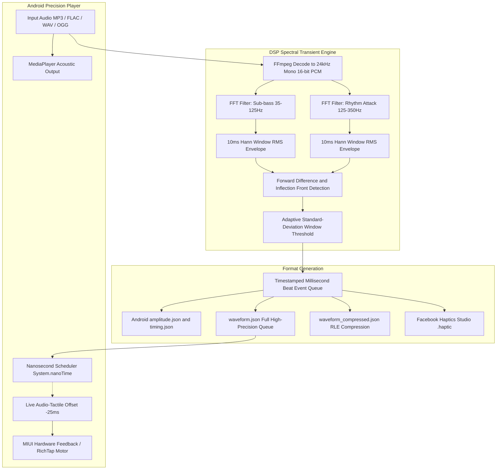

# Audio-to-MIUIHaptic

[](LICENSE)
[](https://www.python.org/)
[](https://developer.android.com/)
[](https://termux.dev/)
[](https://github.com/mgyanik/Audio-to-MIUIHaptic)

[ English | [简体中文](README_zh.md) ]

> High-precision audio to Android haptic waveform generator and ultra-crisp MIUI linear motor player.
> 
> Translates arbitrary audio files into tactile waveforms (Facebook Haptics Studio `.haptic` and Android native `VibrationEffect` arrays), accompanied by a standalone Android linear motor player driven by a 10ms zero-jitter nanosecond clock.

---

## Key Features

1. **Sub-frame Transient Inflection Detection Engine (10ms Resolution)**
   - Traditional RMS envelope trackers suffer from an inherent ~20ms integration rise delay, leading to noticeable haptic lag behind acoustic transients.
   - audio2haptic employs dual-band FFT filtering for sub-bass (35-125Hz) and rhythm attack (125-350Hz) combined with forward difference inflection detection, triggering the tactile response at the exact onset attack front.

2. **Hardware-Level Crisp Haptic Primitives**
   - Eliminates monotonous, dull, and continuous motor buzzing.
   - Maps sound events directly to native low-level hardware constants optimized for Xiaomi MIUI / HyperOS and AAC RichTap X-axis linear resonant actuators:
     - **Sub-Bass / Kick / 808 Drop**: `0x10000004` (`FLAG_MIUI_HAPTIC_MESH_HEAVY`)
     - **Rhythm Strike / Snare / Rimshot**: `0x10000000` (`FLAG_MIUI_HAPTIC_TAP_NORMAL`)
     - **Micro-tick / Guitar Pluck / Hi-Hat**: `0x10000001` (`FLAG_MIUI_HAPTIC_TAP_LIGHT`)

3. **85%+ Percussive Decay and Silence Interval Shaping**
   - Generates sharp 20-30ms exponential decay pulses. This guarantees sufficient idle settling intervals between consecutive strikes, allowing the spring-mass system of the linear motor to come to rest, yielding crisp, mechanical switch-like tactile impacts.

4. **Universal Format Support**
   - **Meta / Facebook Haptics Studio**: Generates compliant `.haptic` JSON files ready for desktop inspection and authoring.
   - **Android AOSP Native**: Generates standard `amplitude[]` and `timing[]` arrays directly compatible with `VibrationEffect.createWaveform()`.
   - **Run-Length Compression (RLE)**: Compresses contiguous silence blocks, reducing payload size by over 70% to prevent Android Binder IPC transaction buffer overflows (1MB limit).

5. **Standalone Lightweight Android Player with Live Latency Calibration**
   - Dedicated worker thread driven by `System.nanoTime()` polling, completely bypassing Android main-thread Looper and Choreographer jitter (10-15ms).
   - Interactive live latency offset adjustment slider (default `-25ms`) to dynamically compensate for Android speaker output buffer delay.
   - Self-contained build script: can be compiled directly on Android devices within Termux without requiring a full Android Studio desktop environment.

---

## Architecture



---

## Repository Structure

```text
audio2haptic/
├── .gitignore
├── LICENSE                         # MIT License
├── README.md                       # English documentation
├── README_zh.md                    # Chinese documentation
├── generator/                      # Python audio-to-haptic CLI tool
│   ├── audio2haptic.py             # Core DSP processing script
│   ├── requirements.txt            # Python dependencies (numpy)
│   └── samples/                    # Sample synthetic audio and outputs
│       ├── demo_beat.wav           # Demonstration rhythm track
│       ├── demo_beat.mp3           # Demonstration MP3
│       ├── demo_beat.haptic        # Meta Haptics Studio file
│       ├── waveform.json           # Millisecond event queue
│       ├── waveform_compressed.json # Run-length compressed waveform
│       ├── amplitude.json          # Amplitude array (0-255)
│       ├── timing.json             # Timing array (ms)
│       └── time_points.json        # Timestamp array (ms)
└── android_player/                 # Android native lightweight player
    ├── AndroidManifest.xml         # Manifest (VIBRATE and WAKE_LOCK permissions)
    ├── build_apk.sh                # Cross-platform build script (Termux/Linux)
    ├── debug.keystore              # Debug signing keystore
    ├── assets/                     # Packaged audio track and haptic files
    │   ├── audio.mp3
    │   ├── waveform.json
    │   └── README.md
    ├── res/                        # Layout and resource files
    │   ├── layout/activity_main.xml
    │   └── values/strings.xml
    └── src/com/haptic/fhsplayer/
        └── MainActivity.java       # High-precision player and hardware motor caller
```

---

## Quick Start

### 1. Prerequisites

- **Python Environment**:
  - Python 3.8+
  - `ffmpeg` (must be accessible in system PATH)
  - `numpy`

Installation on Linux or Termux:
```bash
# Termux
pkg install ffmpeg python python-numpy

# Ubuntu / Debian
sudo apt update && sudo apt install -y ffmpeg python3 python3-numpy
```

---

### 2. Audio Conversion CLI

Run the generator on any audio file:
```bash
python3 generator/audio2haptic.py <path_to_audio> -o <output_directory>
```

#### CLI Parameters:
| Option | Default | Description |
| :--- | :--- | :--- |
| `input` | *(Required)* | Input audio file (supports MP3, FLAC, WAV, OGG, AAC, etc.) |
| `-o, --output-dir` | `<basename>_fhs` | Output directory path |
| `--frame-ms` | `10` | Frame step duration in ms (10ms = 100Hz resolution) |
| `--sensitivity` | `1.15` | Attack onset sensitivity multiplier |
| `--min-separation` | `70` | Minimum separation between consecutive hits in ms |

Example:
```bash
python3 generator/audio2haptic.py generator/samples/demo_beat.wav -o output/demo
```

---

### 3. Build and Run Android Player

#### Option A: Build directly in Termux
The project contains an automated build script utilizing Android CLI build tools:
```bash
# 1. Install build packages in Termux
pkg install openjdk-17 aapt apksigner dx

# 2. Build and sign the APK
cd android_player
bash build_apk.sh
```
The compiled APK will be generated at `android_player/bin/FHSPlayer.apk`. Install it on device:
```bash
pm install -r bin/FHSPlayer.apk
```

#### Option B: Replace with your own music
1. Convert your track using `audio2haptic.py` to obtain `waveform.json`.
2. Convert your track to MP3:
   ```bash
   ffmpeg -i mysong.flac -codec:a libmp3lame -b:a 192k audio.mp3
   ```
3. Copy `waveform.json` and `audio.mp3` into `android_player/assets/`.
4. Re-run `bash build_apk.sh` to package a custom APK tailored to your song.

---

## Device Architecture Compatibility (ARMv7 vs ARMv8)

Understanding target architecture requirements for the player application and DSP generator:

| Component | Target Architecture | Binary / Runtime Model | Compatibility Notes |
| :--- | :--- | :--- | :--- |
| **Android Player (`FHSPlayer.apk`)** | **Universal (`noarch`)** | Java Bytecode (`classes.dex`) | Compatible with **all CPU architectures** (`arm64-v8a`, `armeabi-v7a`, `x86`, `x86_64`) on Android 8.0+ (API 26+). Runs directly on ART/Dalvik VM without native binary dependencies. |
| **Python Generator CLI** | **ARMv8-A (arm64-v8a / 64-bit)** | 64-bit Python / NumPy / FFmpeg | **Recommended**. Standard for modern Android flagships and mid-range devices (Snapdragon 8/7 series, Dimensity, Kirin). Provides 64-bit SIMD NEON acceleration and maximum FFT float throughput. |
| **Python Generator CLI** | **ARMv7-A (armeabi-v7a / 32-bit)** | 32-bit Python / NumPy / FFmpeg | Supported on legacy 32-bit devices and older budget chipsets. Functional, but restricted to 32-bit user-space address space and slightly higher CPU overhead during large audio FFT convolutions. |

### How to verify your device architecture in Termux:
```bash
uname -m
# aarch64 -> ARMv8 (64-bit)
# armv7l / armv8l (in 32-bit userspace) -> ARMv7 (32-bit)
```

---

## MIUI / HyperOS Hardware Haptic Constants Reference

Based on Xiaomi MIUI and AAC RichTap motor kernel definitions, the player invokes low-level hardware vibration constants via `view.performHapticFeedback`:

| Constant Name | Hexadecimal | Decimal | Target Percussion / Instrument |
| :--- | :--- | :--- | :--- |
| `FLAG_MIUI_HAPTIC_TAP_NORMAL` | `0x10000000` | `268435456` | Snare drum, standard rhythm beats, medium accents |
| `FLAG_MIUI_HAPTIC_TAP_LIGHT` | `0x10000001` | `268435457` | Hi-hat, acoustic guitar plucks, subtle transient ticks |
| `FLAG_MIUI_HAPTIC_SWITCH` | `0x10000003` | `268435459` | Mechanical switch toggle, short tactile click |
| `FLAG_MIUI_HAPTIC_MESH_HEAVY` | `0x10000004` | `268435460` | Deep kick drum, 808 bass drops, heavy impacts |
| `FLAG_MIUI_HAPTIC_MESH_LIGHT` | `0x10000006` | `268435462` | Fine-grain granular feedback |
| `FLAG_MIUI_HAPTIC_POPUP_NORMAL` | `0x10000008` | `268435464` | Full crisp popup tactile feedback |

> [!IMPORTANT]
> - On MIUI and HyperOS, the View performing haptic feedback must pass `FLAG_IGNORE_VIEW_SETTING (0x01) | FLAG_IGNORE_GLOBAL_SETTING (0x02)` to prevent system touch-feedback filters from suppressing the vibration.
> - On generic AOSP devices without MIUI constants, the player smoothly falls back to standard `VibrationEffect.createWaveform()`.

---

## License

This project is licensed under the [MIT License](LICENSE).
