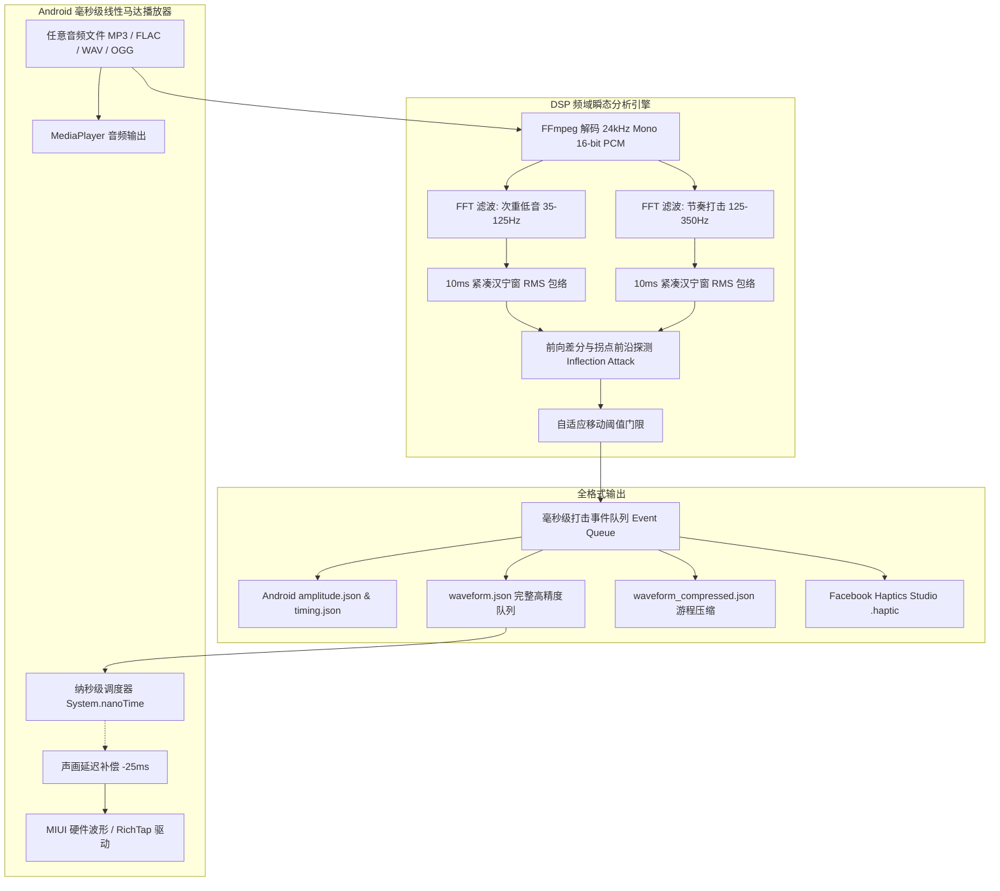

# audio2haptic

[](LICENSE)
[](https://www.python.org/)
[](https://developer.android.com/)
[](https://termux.dev/)
[](https://github.com/mgyanik/audio2haptic)

[ [English](README.md) | 简体中文 ]

> 高精度音频转 Android 触觉波形生成器与 MIUI 线性马达清脆播放器。
> 
> 将任意音频高精度转译为触觉波形（Facebook Haptics Studio `.haptic`、Android 原生 `VibrationEffect` 数组），并提供 10ms 零抖动微秒级时钟直驱的 Android 线性马达播放器。

---

## 核心特性

1. **10ms 纳秒时钟瞬态拐点引擎**
   - 传统 RMS 包络检测存在约 20ms 的积分上升延迟，容易导致触觉明显滞后于听感。
   - 本项目通过对次重低音（35–125Hz）与节奏频段（125–350Hz）的双频段滤波与前向差分拐点检测（Attack Inflection），在能量突变前沿精准触发打击。

2. **硬件级清脆触感映射**
   - 解决单调沉闷的传统马达连续嗡嗡震动问题。
   - 针对小米 MIUI / HyperOS 及 AAC RichTap X轴横向线性马达硬件特性，智能分级映射底层波形常量：
     - **沉稳重低音 / 底鼓 (Kick / 808)**: `0x10000004` (`FLAG_MIUI_HAPTIC_MESH_HEAVY`)
     - **清脆节奏点 / 军鼓 (Snare / Rimshot)**: `0x10000000` (`FLAG_MIUI_HAPTIC_TAP_NORMAL`)
     - **细腻微动 / 前奏拨弦 (Hi-hat / Pluck)**: `0x10000001` (`FLAG_MIUI_HAPTIC_TAP_LIGHT`)

3. **85% 以上动态空闲停顿整形**
   - 采用 20–30ms 极速指数衰减脉冲，确保打击与打击之间有充足的时间让线性马达弹簧归位停振，带来类似机械开关般的干脆利落敲击感。

4. **全生态格式兼容**
   - **Facebook / Meta Haptics Studio**: 输出标准 `.haptic` 格式，支持导入桌面端工程二次编辑。
   - **Android AOSP 原生支持**: 输出 `amplitude[]` 与 `timing[]` 数组，直接兼容 `VibrationEffect.createWaveform`。
   - **RLE 游程压缩**: 自动压缩连续静音段，体积缩减 70% 以上，防止 Android 进程间通信（Binder IPC）溢出 1MB 限制。

5. **独立轻量 Android 播放器与声画延迟实时校准器**
   - 采用独立的高精度线程与 `System.nanoTime()` 轮询，消除 Android 主线程 Looper/Handler 引起的 10~15ms 调度抖动。
   - 内置实时扬声器缓冲延迟补偿滑块（默认 `-25ms`），可在播放中动态微调触觉偏移，实现声震完全合一。
   - 支持在 Termux 终端环境下直接编译，无需桌面端 Android Studio。

---

## 架构流程图



---

## 目录结构

```text
audio2haptic/
├── .gitignore
├── LICENSE                         # MIT 许可证
├── README.md                       # 英文文档
├── README_zh.md                    # 中文文档
├── generator/                      # Python 音频转触觉波形工具
│   ├── audio2haptic.py             # 核心转换脚本
│   ├── requirements.txt            # Python 依赖 (numpy)
│   └── samples/                    # 示例合成音频与转换结果
│       ├── demo_beat.wav           # 演示节奏音轨
│       ├── demo_beat.mp3           # 演示 MP3
│       ├── demo_beat.haptic        # Meta Haptics Studio 工程文件
│       ├── waveform.json           # 完整触觉事件队列
│       ├── waveform_compressed.json # 游程压缩波形
│       ├── amplitude.json          # 振幅数组 (0-255)
│       ├── timing.json             # 时长数组 (ms)
│       └── time_points.json        # 累计时间戳 (ms)
└── android_player/                 # Android 原生轻量触觉播放器工程
    ├── AndroidManifest.xml         # 清单文件 (含 VIBRATE 权限)
    ├── build_apk.sh                # Termux / Linux 一键编译脚本
    ├── debug.keystore              # 签名证书
    ├── assets/                     # 播放器内置音轨与波形资源
    │   ├── audio.mp3
    │   ├── waveform.json
    │   └── README.md
    ├── res/                        # 播放器布局与资源文件
    │   ├── layout/activity_main.xml
    │   └── values/strings.xml
    └── src/com/haptic/fhsplayer/
        └── MainActivity.java       # 核心播放逻辑与 MIUI 硬件触发
```

---

## 快速上手

### 1. 环境准备

- **Python 端**：
  - Python 3.8+
  - `ffmpeg` (必须加入系统 PATH)
  - `numpy`

在 Linux / Termux 中安装：
```bash
# Termux
pkg install ffmpeg python python-numpy

# Ubuntu / Debian
sudo apt update && sudo apt install -y ffmpeg python3 python3-numpy
```

---

### 2. 使用 Python 转换音频

进入 `generator/` 目录：
```bash
python3 generator/audio2haptic.py <音频文件路径> -o <输出目录>
```

#### 常用参数说明：
| 参数 | 默认值 | 说明 |
| :--- | :--- | :--- |
| `input` | *(必填)* | 输入音频文件（支持 MP3, FLAC, WAV, OGG, AAC 等） |
| `-o, --output-dir` | `<音频同名_fhs>` | 输出目录 |
| `--frame-ms` | `10` | 帧步进时长（毫秒），默认 10ms (100Hz 刷新率) |
| `--sensitivity` | `1.15` | 打击起音检测灵敏度阈值倍数 |
| `--min-separation` | `70` | 两次击打之间最小时间间隔（毫秒），防止过密连击震动黏连 |

运行示例：
```bash
python3 generator/audio2haptic.py generator/samples/demo_beat.wav -o output/demo
```

---

### 3. 构建与运行 Android 播放器

#### 方式 A：在 Termux 终端中直接构建
本项目内置了自动化构建脚本，只要在 Termux 下安装了构建工具即可一键打包：
```bash
# 1. 安装构建依赖
pkg install openjdk-17 aapt apksigner dx

# 2. 一键编译并签名 APK
cd android_player
bash build_apk.sh
```
编译完成后，会在 `android_player/bin/FHSPlayer.apk` 生成安装包。在手机上执行安装：
```bash
pm install -r bin/FHSPlayer.apk
```

#### 方式 B：使用自己的歌曲替换
1. 使用 `audio2haptic.py` 转换你的歌曲（如 `music.flac`），得到 `waveform.json`。
2. 用 ffmpeg 转为 mp3：
   ```bash
   ffmpeg -i music.flac -codec:a libmp3lame -b:a 192k audio.mp3
   ```
3. 将 `waveform.json` 和 `audio.mp3` 覆盖到 `android_player/assets/` 目录下。
4. 重新执行 `bash build_apk.sh` 即可生成属于这首歌曲的专属触感 APK。

---

## MIUI / HyperOS 硬件常量技术参考

根据小米及 AAC RichTap 触觉系统内核定义，支持以下底层硬件波形常量（通过 `view.performHapticFeedback` 注入系统忽略标志触发）：

| 常量名 | 16进制值 | 对应十进制 | 适用乐器与场景 |
| :--- | :--- | :--- | :--- |
| `FLAG_MIUI_HAPTIC_TAP_NORMAL` | `0x10000000` | `268435456` | 军鼓、清脆常规拍、次重音 |
| `FLAG_MIUI_HAPTIC_TAP_LIGHT` | `0x10000001` | `268435457` | 踩镲、吉他拨弦、微弱轻音 |
| `FLAG_MIUI_HAPTIC_SWITCH` | `0x10000003` | `268435459` | 机械开关微弹、短瞬态 |
| `FLAG_MIUI_HAPTIC_MESH_HEAVY` | `0x10000004` | `268435460` | 重低音底鼓、808 Drop、下潜顿挫 |
| `FLAG_MIUI_HAPTIC_MESH_LIGHT` | `0x10000006` | `268435462` | 极细颗粒感 |
| `FLAG_MIUI_HAPTIC_POPUP_NORMAL` | `0x10000008` | `268435464` | 饱满清脆弹窗反馈 |

> [!IMPORTANT]
> - 在较新版本 MIUI / HyperOS 中，触发系统级触觉常量的 View 必须设置以下标志以防止系统静音过滤：
>   `FLAG_IGNORE_VIEW_SETTING (0x01)` | `FLAG_IGNORE_GLOBAL_SETTING (0x02)`。
> - 在原生 AOSP / 非 MIUI 设备上，系统会自动平滑降级为 `VibrationEffect.createWaveform` 振幅波形播放。

---

## 开源许可证

本项目采用 [MIT License](LICENSE) 开源协议。
